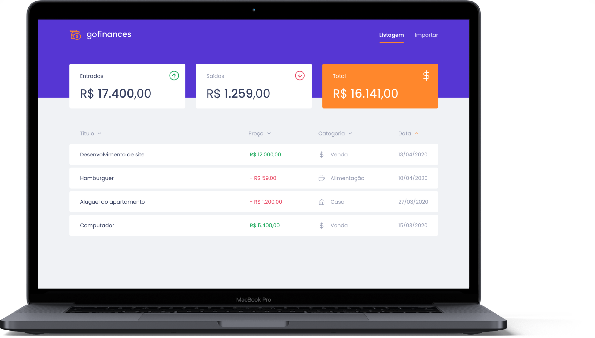

  <p align="center">
    
    </br>
    
    
  </p>

<h3 align="center">
  O projeto desenvolvido é o GoFinances Web, a continuação de uma aplicação para armazenar transações financeiras de entrada e saída e permitir o cadastro e a listagem dessas transações, além de permitir a criação de novos registros no banco de dados a partir do envio de um arquivo csv. Nessa etapa foi utilizado o que foi aprendido sobre ReactJS junto com TypeScript, utilizando rotas e envio de arquivo por formulário.
</h3>

<p align="center">
  

  

  
</p>

<p align="center">
  <a href="#funcionalidades">Funcionalidades</a>&nbsp;&nbsp;&nbsp;|&nbsp;&nbsp;&nbsp;
  <a href="#heavy_check_mark-configurações-necessárias">Configurações necessárias</a>&nbsp;&nbsp;&nbsp;|&nbsp;&nbsp;&nbsp;
  <a href="#arrow_down_small-clonando-o-repositório">Clonando o repositório</a>&nbsp;&nbsp;&nbsp;|&nbsp;&nbsp;&nbsp;
  <a href="#beginner-iniciando-a-aplicação">Iniciando a aplicação</a>&nbsp;&nbsp;&nbsp;|&nbsp;&nbsp;&nbsp;
  <a href="#wrench-tecnologias--ferramentas--recursos">Tecnologias | Ferramentas | Recursos</a>&nbsp;&nbsp;&nbsp;|&nbsp;&nbsp;&nbsp;
  <a href="#memo-license">Licença</a>
</p>

Durante as aulas do [RocketSeat GoStack Bootcamp](https://rocketseat.com.br/bootcamp) foram aprendidos conteúdos relacionados a ReactJS junto com TypeScript, utilizando a biblioteca Styled Components para estilizar a aplicação. Para treinar o que foi aprendido até o momento foi feita a conexão com o back-end desenvolvido no exercício anterior e a estilização da aplicação, exibindo as transações criadas e permitindo a importação de um arquivo CSV para gerar novos registros no banco de dados.

### Funcionalidades

- Criação de transações financeiras de entrada e saída;
- Listagem das transações registradas;
- Criação de novos registros no banco de dados a partir do envio de um arquivo csv.

### :heavy_check_mark: Configurações necessárias

Seguem as configurações neessárias para visualizar a aplicação em sua máquina.

-  [Git](https://git-scm.com);
-  [Node](https://nodejs.org/);
-  [Yarn](https://yarnpkg.com/).

### :arrow_down_small: Clonando o repositório
1. Pelo terminal, acesse o diretório em que deseja ter o repositório clonado e execute o comando a seguir.
```bash
# clonando o repositório
git clone https://github.com/belapferreira/fundamentos-reactjs
```
2. Clone o back-end conforme orientações do repositório que pode ser acessado através do link [Back-end GoFinances](https://github.com/belapferreira/database-upload).

### :beginner: Iniciando a aplicação
1. Inicie o back-end conforme orientações do repositório que pode ser acessado através do link [Back-end GoFinances](https://github.com/belapferreira/database-upload);
2. Pelo terminal, acesse o diretório do repositório do front-end clonado e execute os comandos abaixo.
```bash
# instalando as dependências
yarn install

# iniciando a aplicação
yarn start
```
### :mag: Realizando os testes
1. Foi usado um template que contém testes para orientar o que esperava-se dos blocos de códigos a serem programados. Para verificar se qualquer alteração realizada atende aos requisitos solicitados, acesse o terminal e execute o seguinte comando:
```bash
# testando atendimento aos requisitos
yarn test
```
Na pasta `assets` que faz parte da pasta `src` há um arquivo chamado `teste.csv` que pode ser utilizado para testar a funcionalidade da rota de importação.

Você pode utilizar ferramentas como o Insomnia, o Postman e o Postwoman para testar as rotas e requisições configuradas e o DBeaver para acompanhar a criação das tabelas e registros no banco de dados.

### :wrench: Tecnologias | Ferramentas | Recursos

Esse projeto foi desenvolvido utilizando os seguintes recursos:

-  [Axios](https://github.com/axios/axios);
-  [Editor Config](https://editorconfig.org/);
-  [Eslint](https://eslint.org/);
-  [Filesize](https://github.com/ampproject/filesize);
-  [Jest](https://jestjs.io/);
-  [History](https://github.com/ReactTraining/history);
-  [Polished](https://github.com/styled-components/polished);
-  [Prettier](https://prettier.io/)
-  [React](https://pt-br.reactjs.org/);
-  [React DOM](https://pt-br.reactjs.org/docs/react-dom.html);
-  [React Dropzone](https://react-dropzone.js.org/);
-  [React Router Dom](https://reactrouter.com/web/guides/quick-start);
-  [React Scripts](https://github.com/facebook/create-react-app/tree/master/packages/react-scripts);
-  [Styled Components](https://styled-components.com/);
-  [TypeScript](https://www.typescriptlang.org/).


### :memo: License
Esse projeto está sob MIT license. Veja [LICENSE](https://github.com/belapferreira/fundamentos-reactjs/blob/master/LICENSE) para mais informações.

---

Feito por Bela Ferreira :blue_heart: Contato: https://www.linkedin.com/in/belapferreira :blush:
